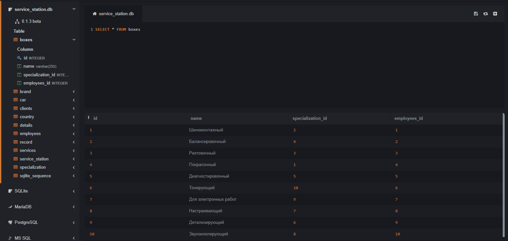
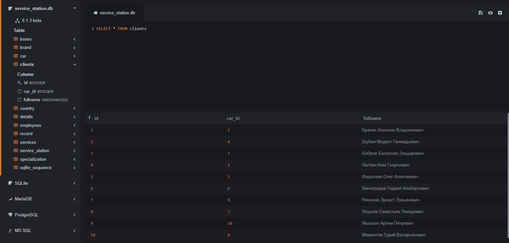
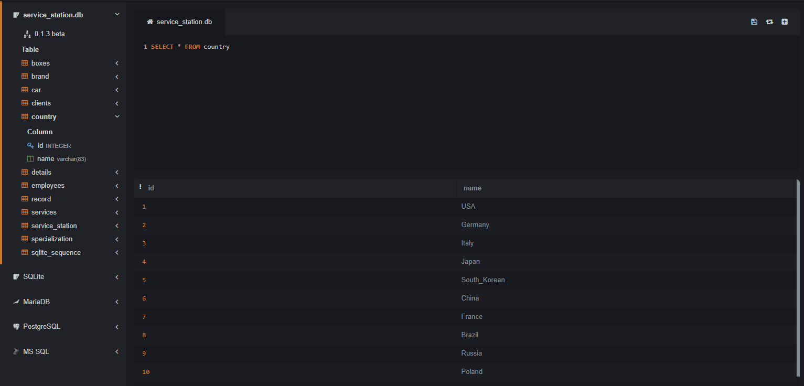
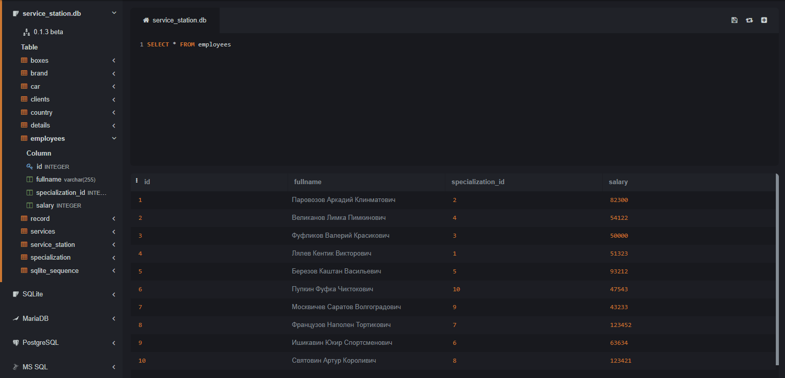

# Калявин Владислав Олегович, ИС22/9-1 #
Я создал бд "service station" на тему "СТО".

## Описание Бд ##
**Таблица boxes**
*id: INTEGER (Primary Key, Autoincrement)* - уникальный идентификатор ящика
*name: varchar(255)* - название ящика
*specialization_id: INTEGER* - идентификатор специализации, связан с таблицей **specialization**
*employees_id: INTEGER* - идентификатор сотрудника, связан с таблицей **employees**

**Таблица brand**
*id: INTEGER (Primary Key, Autoincrement)* - уникальный идентификатор бренда
*name: varchar(255)* - название бренда
*country_id: INTEGER* - идентификатор страны, связан с таблицей **country**

**Таблица car**
*id: INTEGER (Primary Key, Autoincrement)* - уникальный идентификатор автомобиля
*fullname: varchar(255)* - полное название автомобиля
*country_id: INTEGER* - идентификатор страны, связан с таблицей **country**
*brand_id: INTEGER* - идентификатор бренда, связан с таблицей brand

**Таблица clients**
*id: INTEGER (Primary Key, Autoincrement)* - уникальный идентификатор клиента
*car_id: INTEGER* - идентификатор автомобиля, связан с таблицей **car**
*fullname: VARCHAR(255)* - полное имя клиента

**Таблица country**
*id: INTEGER (Primary Key, Autoincrement)* - уникальный идентификатор страны
*name: varchar(83)* - название страны

**Таблица details**
*id: INTEGER (Primary Key, Autoincrement)* - уникальный идентификатор детали
*fullname: varchar(255)* - полное наименование детали
*country_id: INTEGER* - идентификатор страны, связан с таблицей **country**
*car_id: INTEGER* - идентификатор автомобиля, связан с таблицей **car**
*partscost: NUMERIC* - стоимость детали

**Таблица employees**
*id: INTEGER (Primary Key, Autoincrement)* - уникальный идентификатор сотрудника
*fullname: varchar(255)* - полное имя сотрудника
*specialization_id: INTEGER* - идентификатор специализации, связан с таблицей **specialization**
*salary: INTEGER* - зарплата сотрудника

**Таблица record**
*id: INTEGER (Primary Key, Autoincrement)* - уникальный идентификатор записи
*client_id: INTEGER* - идентификатор клиента, связан с таблицей **clients**
*date: date* - дата записи
*service_id: INTEGER* - идентификатор услуги, связан с таблицей 
**services**

**Таблица services**
*id: INTEGER (Primary Key, Autoincrement)* - уникальный идентификатор услуги
*box_id: INTEGER* - идентификатор ящика, связан с таблицей **boxes**
*service_cost: NUMERIC* - стоимость услуги
*name: VARCHAR(255)* - название услуги

**Таблица service_station**
*id: INTEGER (Primary Key, Autoincrement)* - уникальный идентификатор станции обслуживания
*detail_id: INTEGER* - идентификатор детали, связан с таблицей **details**
*service_id: INTEGER* - идентификатор услуги, связан с таблицей **services**

**Таблица specialization**
*id: INTEGER (Primary Key, Autoincrement)* - уникальный идентификатор специализации
*name: varchar(255)* - название специализации
