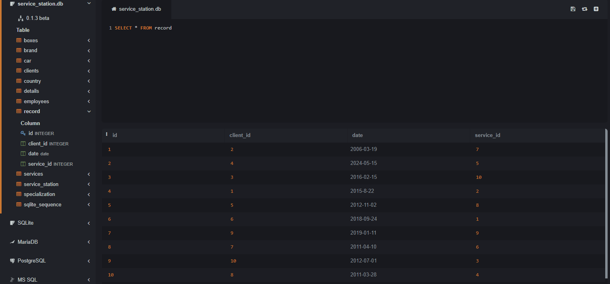
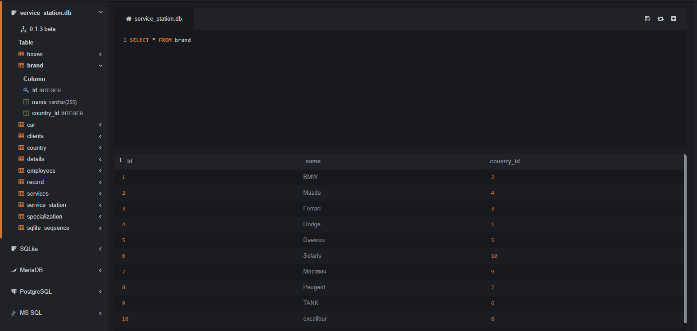
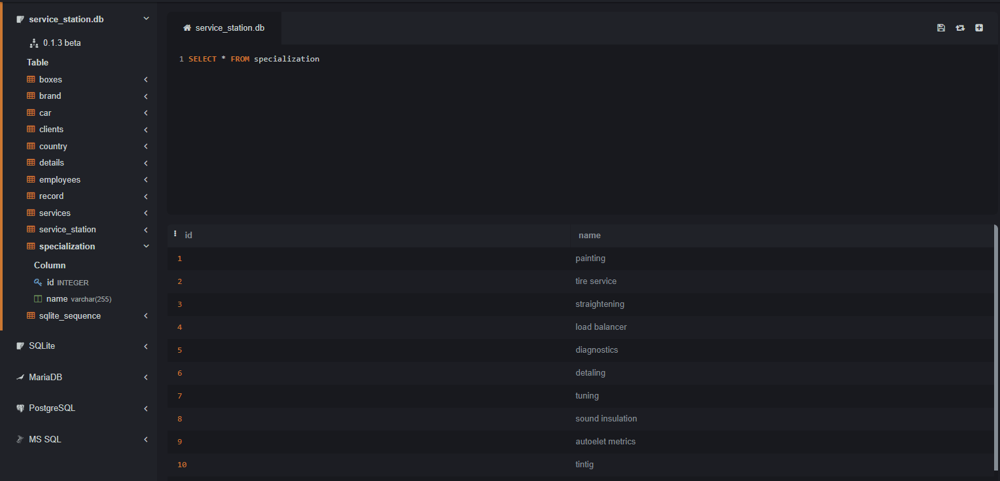
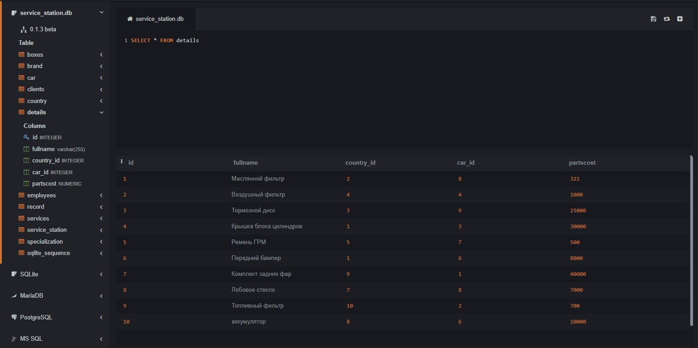
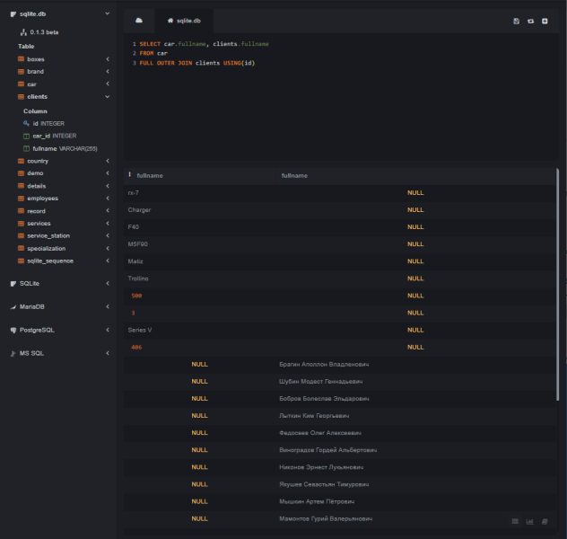

1. # Калявин Владислав, ИС 22/9-1
2. ## Описание базы данных
- База данных спроектирована для управления информацией о спортивных событиях. В ней содержатся следующие сущности (таблицы) и их атрибуты:
### Описание сущностей
1. #### Таблица clients
- id (int): Уникальный идентификатор клиента.
- fullname (varchar): Полное имя клиента.
- car_id (int): Идентификатор машины клиента.

2. #### Таблица record
- id (int): Уникальный идентификатор записи об обслуживании.
- client_id (int): Идентификатор клиента, связанный с записью.
- date (date): Дата обслуживания.
- service_id (int): Идентификатор оказанной услуги.
- 

3. #### Таблица services
- id (int): Уникальный идентификатор услуги.
- box_id (int): Идентификатор бокса, в котором оказывается услуга.
- service_cost (numeric): Стоимость услуги.
- name (varchar): Название услуги.
- 

4. #### Таблица employees
- id (int): Уникальный идентификатор сотрудника.
- fullname (varchar): Полное имя сотрудника.
- specialization_id (int): Идентификатор специализации сотрудника.
- salary (numeric): Зарплата сотрудника.
- 

5. #### Таблица boxes
- id (int): Уникальный идентификатор бокса.
- name (varchar): Название бокса.
- employees_id (int): Идентификатор сотрудника, ответственного за бокс.
- specialization_id (int): Идентификатор специализации, связанной с боксом.
- 
1. #### Таблица car
- id (int): Уникальный идентификатор машины.
- fullname (varchar): Полное имя или модель машины.
- brand_Id (int): Идентификатор бренда машины.
- country_Id (int): Идентификатор страны происхождения бренда.
- 

1. #### Таблица country
- id (int): Уникальный идентификатор страны.
- name (varchar): Название страны.
- 

1. #### Таблица brand
- id (int): Уникальный идентификатор бренда.
- name (varchar): Название бренда.
- country_id (int): Идентификатор страны, в которой зарегистрирован бренд.
- 

1. #### Таблица specialization
- id (int): Уникальный идентификатор специализации.
- name (varchar): Название специализации.
- 

1.   #### service_station
- id (int): Уникальный идентификатор станции обслуживания.
- service_id (int): Идентификатор услуги, предоставляемой на этой станции.
- detail_id (int): Идентификатор детали, используемой при оказании услуги.
- 

1.   #### details
- id (int): Уникальный идентификатор детали.
- name (varchar): Название детали.
- country_id (int): Идентификатор страны производства детали.
- car_id (int): Идентификатор автомобиля, для которого предназначена деталь.
- partscost (numeric): Стоимость детали.
- 
  
## Демонстрация SQL-запросов
1. ## UNION
    ```sql
    SELECT name FROM brand
    UNION
    SELECT fullname FROM car;
    ```
     

    Этот запрос выводит список моделей и марок авто, в алфавитном порядке.

2. ## ORDER BY
    ```sql
    SELECT fullname, salary FROM employees
    ORDER BY salary DESC;
    ```

     

    Этот запрос выводит имена и з/п работников, упорядоченные по убыванию з/п, т.е. от самого богатого к самому бедному.

3. ## HAVING
    ```sql
   SELECT name, COUNT(id) AS brands_count
    FROM brand
    GROUP BY country_id
    HAVING country_id > 5;
    ```

     

    Этот запрос выводит бренды и количество машин этого бренда, но только для тех брендов, у которых id страны более 4.

4. ## Вложенные Запросы
    ### В SELECT

    ```sql
   SELECT name, 
       (SELECT name
        FROM country
        WHERE brand.country_id = country.id) as brand_country
    FROM brand;
    ```
     

    Этот запрос выводит название каждого бренда и страну производитель этих марок.

    ### В WHERE
    ```sql
    SELECT * FROM services
    WHERE service_cost = (
        SELECT service_cost FROM services ORDER BY service_cost ASC LIMIT 1
    )
    ```
     

    Этот запрос выводит все данные самой дешёвой услуги.
5. ## Оконные функции
    ## Агрегатные функции
    ```sql
      SELECT fullname,
        COUNT(country_id) OVER (PARTITION BY country_id) AS country 
    FROM car;
    ```

     

    Этот запрос выводит количество стран выпускающих именно эти модели машин. 
    ## Ранжирующие функции
    ```sql
    SELECT name,
        service_cost,
        RANK() OVER (ORDER BY service_cost) AS rank
    FROM services
    ```

     

    Этот запрос выводит название, стоимость и ранг услуги.
    ## Функции смещения
    ```sql
        SELECT fullname,
        partscost,
        car_id,
        LAG(partscost) OVER (PARTITION BY id ORDER BY country_id) AS prev_price,
        LEAD(partscost) OVER (PARTITION BY id ORDER BY country_id) AS next_price
    FROM details;
    ```
   

Этот запрос выводит название детали, стоимость, и id ремонтируемой машины, а также предыдущую и следующую цену в хронологическом порядке.

8. ## JOINs

    ## Inner Join

    ```sql
    SELECT fullname, name
    FROM employees
    JOIN boxes USING(id)
    ```
     

    Этот запрос выводит имя работника и его рабочий бокс.
    ## Left Join

   ```sql
    SELECT fullname, name
    FROM employees
    LEFT JOIN specialization USING(id)
    ```
     

    Этот запрос выводит имя работника и его специализацию.
    ## Right Join

   ```sql
    SELECT boxes.name, specialization.name
    FROM boxes
    RIGHT JOIN boxes USING(id)
    ```
     

    Этот запрос выводит бокс и то, на чем он специализируется.

    ## Cross Join

    ```sql
    SELECT boxes.name, services.name
    FROM boxes
    CROSS JOIN services USING(id)
    ```
     

    Этот запрос выводит название бокса и услугу, которую он предоставляет.

    ## Full Outer Join

    ```sql
    SELECT car.fullname, clients.fullname
    FROM car
    FULL OUTER JOIN clients USING(id)
    ```
     

    Этот запрос выводит модель машины и имя клиента для всех записей из обеих таблиц. Если соответствующая запись отсутствует в одной из таблиц, то соответствующее поле будет содержать NULL.


9. ## CASE

    ### Оператор CASE

    ```sql
    SELECT fullname, country_id,
        CASE 
            WHEN country_id = '1' THEN 'Американец'
            WHEN country_id = '2' THEN 'Немец'
            WHEN country_id = '4' THEN 'Японец'
            ELSE 'другое'
        END AS nation
    FROM car;
    ```
     

    Этот запрос выводит модель авто, но в зависимости от его страны-производителя добавляет префикс для форматирования. Например, для Германии добавляется префикс "Немец", для Японии - "Японец", для США - "Американец".
10. ## WITH
    ### Ключевое слово WITH

    ```sql
    WITH Japan_Cars AS (
        SELECT fullname, name
        FROM car
        JOIN brand ON car.brand_id = brand.id WHERE car.country_id = 4)
    SELECT * FROM Japan_Cars;
    ```
    
    Этот запрос создает временную таблицу `Japan_Cars`, которая содержит модель и марку машины, и выводит все записи из этой временной таблицы.